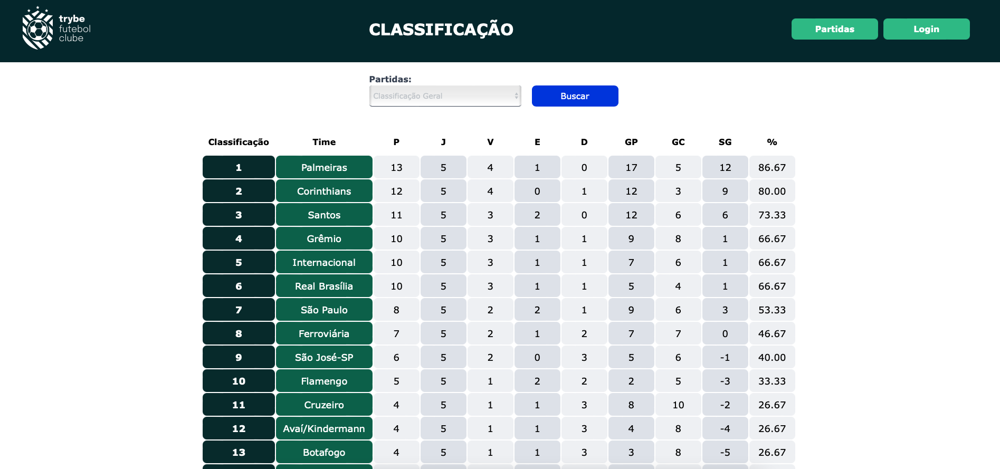

<h1 align="center">
    <a href="#"> Trybe Futebol Clube 🏆</a>
</h1>

<h4 align="center">
	 Status: Concluído
</h4>

<p align="center">
 <a href="#about">Sobre</a> •
 <a href="#components">Diferencial</a> •
 <a href="#instruções">Instruções</a> •
 <a href="#demonstration">Demostração</a> •
 <a href="#endPoints">End Points</a> •
 <a href="#license">License</a>
</p>

<br />
<div id="about" />

## 💻 Sobre:

A partir de uma aplicação Front-End desenvolvida pela _[Trybe](https://www.betrybe.com)_, foi desenvolvido um API para prover as informações necessárias para um site informativo sobre partidas e classificações de futebol!

* Construída com Node.js, Express, Typescript, MySQL, Sequelize e Docker
* Utilizando os princípios SOLID e Programação Orientada a Objetos
* Aplicando Arquitetura de Software, com as camadas de Modelo, Serviço e de Controladores
* Testes de Integração criadas utilizando Mocha, Chai, ChaiHTTP e Sinon

---

<br />
<div id="components" />

## Qual é o diferencial deste código Diferencial

Essa é a minha **Obra Prima**, me dediquei muito a construir o front-end, e ele foi feito com perfeição, usando um único handler de erro capaz de administrar erros de vários tipos, foi feito completamente em Typescript pensando em escalabilidade, todo código é extremamente legível e resumido, todas as funções são bem framentadas por necessidade, toda estrutura do Back-end feita em MSC é pensada para o código principal só rodar depois de todas as validações passarem, de fato, uma obra de arte.

---

<br />
<div id="instruções" />

## 🚀 Como executar o projeto.

```bash

# Clone este repositório

# Acesse o terminal do seu sistema operacional e escolha uma pasta de sua preferencia
# cole o comando abaixo no terminal
$ git clone git@github.com:JoaoAlberto20/trybe-futebol-fc.git


# Entre na pasta clonada com seguinte comando
$ cd trybe-futebol-fc

# Rodando a aplicação com DOCKER em modo de Desenvolvimento:
$ npm run compose:up:dev
$ npm run compose:down:dev # para parar completamente a aplicação

# Ronde a aplicação com DOCKER em Produção:
$ npm run compose:up
$ npm run compose:down  # para parar completamente a aplicação

# Rodando os teste:
$ cd app/backend
$ npm run test:

# O servidor inciará na porta:6006 - acesse <  http://localhost:6006 >

```
---

<br />
<div id="deploy" />

<div id="demonstration" />

## 🎨 Demostração

<p align="center">
  <br />
  
</p>

<br />

<div id="endPoints" />

## 🎲 Endpoints do Back-End

#### Login

| Método | Funcionalidade | URL |
|---|---|---|
| `POST` | Realiza o login do usuário | http://localhost:3001/login |
| `GET` | Avalia se o usuário é o administrador | http://localhost:3001/login/validate |

Nessa requisição POST é necessário informar o seguinte JSON:

```
{
  "email": "Nome do Usuário",
  "password": "senha_secreta"
}
```

#### Times

| Método | Funcionalidade | URL |
|---|---|---|
| `GET` | Retorna todos os times cadastrados | http://localhost:3001/teams |
| `GET` | Retorna um time específico | http://localhost:3001/teams/:id |

#### Partidas

| Método | Funcionalidade | URL |
|---|---|---|
| `GET` | Retorna todos as partidas cadastradas | http://localhost:3001/matches |
| `GET` | Retorna todos as partidas cadastradas em progresso | http://localhost:3001/matches?inProgress=true |
| `GET` | Retorna todos as partidas cadastradas finalizadas | http://localhost:3001/matches?inProgress=false |
| `POST` | Criação de uma nova partida | http://localhost:3001/matches |
| `PATCH` | Atualiza a chave 'inProgress' para finalidado de uma partida específica | http://localhost:3001/matches/:id/finish |
| `PATCH` | Atualiza os gols de uma partida específica | http://localhost:3001/matches/:id |

Nessa requisição POST é necessário informar o seguinte JSON:

```
{
  "homeTeam": 16, // O valor deve ser o id do time
  "awayTeam": 8, // O valor deve ser o id do time
  "homeTeamGoals": 2,
  "awayTeamGoals": 2,
  "inProgress": true
}
```

e na requisição PATCH para atualizar os gols realizados é necessário informar o seguinte JSON:

```
{
  "homeTeamGoals": 3,
  "awayTeamGoals": 1
}
```
#### Placar

| Método | Funcionalidade | URL |
|---|---|---|
| `GET` | Retorna a classificação geral dos times | http://localhost:3001/leaderboard |
| `GET` | Retorna a classificação dos times mandantes | http://localhost:3001/leaderboard/home |
| `GET` | Retorna a classificação dos times visitantes | http://localhost:3001/leaderboard/away |

<br />

<div id="license" />

## 📝 License

This project is under the license [MIT](./LICENSE).

Made with ❤️ by João Alberto [Get in Touch!](https://www.linkedin.com/in/joaoalbertosvcode)

---
